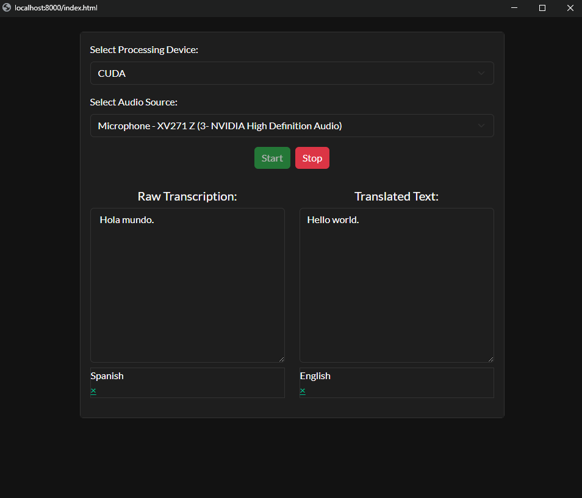

# Real-Time Speech Transcription & Translation App

This project is a **real-time speech transcription and translation application** that leverages **OpenAI's Whisper model** for speech recognition and **Meta's Llama model** for language translation. The application uses **Eel** to provide a web-based user interface, making it accessible and user-friendly.



## 🔹 How It Works

1. **Captures Live Audio**  
   The program records audio from a microphone or system audio in real-time.
   
2. **Speech-to-Text with Whisper**  
   The recorded speech is transcribed using **OpenAI's Whisper Large v3 Turbo** model, which provides **highly accurate** multilingual transcription.

3. **Translation with Llama**  
   The transcribed text is translated into the selected target language using **Meta’s Llama 3 3B Instruct (FP16)** model, ensuring **high-quality translations**.

4. **Real-Time Display**  
   The transcription and translation results are displayed in a web-based interface built with **Eel**.

---

## 📌 Models Used

### **Whisper Large v3 Turbo (OpenAI)**
- **Purpose:** Converts speech into text (ASR - Automatic Speech Recognition).
- **Features:**
  - Supports **multilingual** transcription in over 70 languages.
  - High accuracy, even for noisy audio.
  - Robust handling of accents, background noise, and technical speech.
  - Uses deep learning techniques for precise word recognition.

### **Llama 3 3B Instruct (Meta)**
- **Purpose:** Translates the transcribed text into a target language.
- **Features:**
  - **3 Billion parameters** optimized for fast and accurate language processing.
  - **FP16 precision**, allowing optimized GPU inference.
  - Generates natural and grammatically correct translations.
  - Can handle complex sentence structures with contextual understanding.

---

## 🔥 Features
- **Real-time Speech Transcription**: Whisper converts spoken words into text instantly.
- **Automatic Language Translation**: Llama translates the transcribed text into the selected target language.
- **Supports Multiple Input Sources**: Works with both **microphone** and **system audio**.
- **GPU Acceleration**: Uses CUDA for **faster** transcription and translation when available.
- **User-Friendly Web UI**: Built with **Eel**, allowing easy interaction.

---

## 🛠️ Technologies Used
- **Python**: Core programming language.
- **Eel**: Web-based UI framework.
- **Hugging Face Transformers**: Model integration for Whisper and Llama.
- **Torch**: Deep learning framework for running AI models.
- **Librosa**: Audio analysis and silence detection.
- **Ollama**: Handles Llama-based translation processing.
- **SoundCard**: Captures audio input.

---

## 🚀 Installation & Usage

### **1. Install Dependencies**
```bash
pip install -r requirements.txt
```

### **2. Run the Application**
```bash
python main.py
```

### **3. Check GPU Compatibility**
```bash
python gpu_test.py
```

---

## 🔮 Future Enhancements
- Support for additional speech models.
- Improved UI and real-time feedback.
- Enhanced accuracy in noisy environments.
- Fine-tuning options for Whisper and Llama models.
